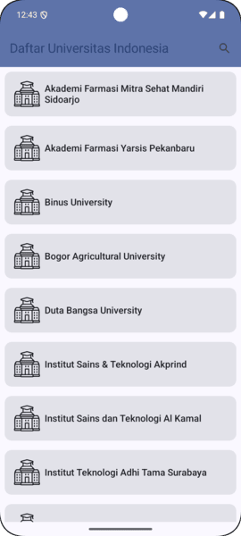
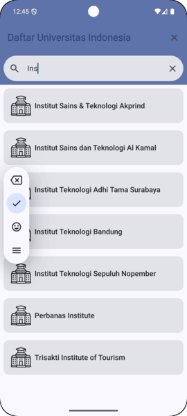

# University List App Using MVVM 

This is a simple app that uses MVVM and Jetpack Compose, this app have offline mode features using Room

## Authors

- [@VikiAndrianto](https://www.github.com/viki88)

## Features

- Show University List in Indonesia
- Search University by Name 
- Detail Website University
- Offline mode

## Tech Stack
- [Jetpack Compose](https://developer.android.com/compose) 
- [MVVM](https://developer.android.com/topic/architecture)
- [Hilt for dependencies Injection](https://developer.android.com/training/dependency-injection/hilt-android)
- [Retrofit](https://square.github.io/retrofit/)
- [Coil for Image Loading](https://github.com/coil-kt/coil)
- [Shimmer Compose for shimmer effect loading](https://github.com/valentinilk/compose-shimmer)
- [Splash Screen Core for Splash Screen display](https://developer.android.com/develop/ui/views/launch/splash-screen)
- [Room for manage offline mode](https://developer.android.com/training/data-storage/room)
- [Mockk for unit test library](https://mockk.io/)

## Screenshots

## Appendix

Icon source from Flaticon : 

- https://www.flaticon.com/free-animated-icons/school
- https://www.flaticon.com/free-icons/university

